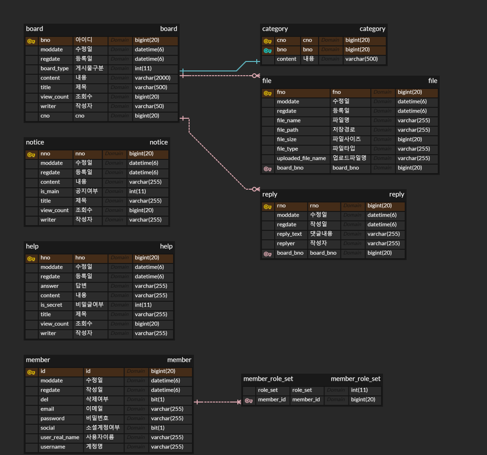

#  junghun's portfolio

## 프로젝트 소개
이 포트폴리오는 스프링 부트와 Vue.js를 활용하여 개발되었습니다. </br>
게시판에서 가장 범용적으로 많이 사용되는 기능들을 구현하였습니다. </br>
Restful API를 최대한 준수하여 개발하고자 노력하였습니다. </br>


⚠️ <b>주의: 비용 절감을 위해 t2.micro 인스턴스를 사용하였으므로, 속도가 다소 느릴 수 있습니다. </b>
## <a href="http://13.210.146.57:1542" target="_blank"> 포트폴리오 링크 <= </a>

사용자 아이디 : user

사용자 비밀번호 : a1234 

사용자 아이디 : admin

사용자 비밀번호 : a1234


</br>

## <a href="https://documenter.getpostman.com/view/22369547/2sA3BoZWgk" target="_blank"> Api 문서</a>
- 포트폴리오의 postman 기반 api 문서

</br>


## ⭐ 주요 기능
- 사용자 및 관리자의 기능 분기
- 백엔드, 프론트엔드 개발 및 운영 환경 분리
- 프론트의 상태 관리
- JPA를 통해 영속성 관리
- 첨부파일, 댓글, 정렬 등 게시판이 기본으로 필요로 하는 대부분의 기능 구현


## 화면리스트
화면설명은 동영상으로


</br>

## 코드 간략설명

<details>
<summary><b>스프링 시큐리티</b></summary>
<div markdown="1">

```java
/**
 * 1. 로그인은 CustomSecurityConfig의 APILoginFilter로부터 시작되며 "/login"으로 시작됩니다.
 * 2. id,password을 통해 로그인이 진행되며 결과에 따라 처리됩니다.
 * 3. tokenCheckFilter를 통해 요청의 header의 accessToken을 확인합니다.
 * 4. 1) accessToken의 유효기간이 만료된 경우 클라이언트에선 /api/refreshToken 요청합니다
      2) refreshToken이 유효할 경우 accessToken을 재발급하며 기타 정책에 의해 refreshToken를 관리합니다. 
 */
class CustomSecurityConfig{
	
    ...
     
	//ApiLoginFilter
	APILoginFilter apiLoginFilter = new APILoginFilter("/login");
		apiLoginFilter.setAuthenticationManager(authenticationManager);
		http.addFilterBefore(apiLoginFilter, UsernamePasswordAuthenticationFilter.class);

	//ApiLoginSuccessHandler
	ApiLoginSuccessHandler apiLoginSuccessHandler = new ApiLoginSuccessHandler(jwtUtil);
		apiLoginFilter.setAuthenticationSuccessHandler(apiLoginSuccessHandler);

	//api로 시작하는 모든 경로는 tokenfilterchain 동작
    http.addFilterBefore(tokenCheckFilter(jwtUtil, userDetailsService),
	UsernamePasswordAuthenticationFilter.class);

	//refreshtoken 호출처리
    http.addFilterBefore(new RefreshTokenFilter("/api/refreshToken", jwtUtil),
	TokenCheckFilter.class);

		http.cors()
			.and()
		    .csrf()
		    .disable()
		    .sessionManagement()
		    .sessionCreationPolicy(SessionCreationPolicy.STATELESS)
		    .and()
		    .formLogin()
		    .disable()
		    .httpBasic()
		    .disable()
		    .authorizeRequests()
		    .antMatchers(PERMIT_URL_ARRAY)
		    .permitAll()
		    .anyRequest()
		    .authenticated();

		http.exceptionHandling().accessDeniedHandler(accessDeniedHandler()); // 403

		return http.build();
}
...
}

```
</div>
</details>
<details>
<summary><b>JPA</b></summary>
<div markdown="1">

``` java

/**
Querydsl로 쿼리를 작성한 영역으로 클라이언트의 요청에 따라
where, order by 등을 분기하여 조회하고 
그러한 결과를 반환할 수 있도록 했습니다. 
*/
class BoardSearchImpl{
    ...
	public Page<BoardListDTO> searchBoardListWithReplyandFiles(String[] types, String keyword,
		String sort, String order, Pageable pageable) {
		
		...
		
		QBoard board = QBoard.board;
		QReply reply = QReply.reply;
		QFile file = QFile.file;
		QCategory category = QCategory.category;

		JPQLQuery<Board> query = from(board);
		query.leftJoin(board.category, category);
		query.leftJoin(reply).on(reply.board.eq(board));
		query.leftJoin(file).on(file.board.eq(board));

		query.groupBy(board);

		if ((types != null && types.length > 0) && keyword != null) {
			BooleanBuilder booleanBuilder = new BooleanBuilder();

			for (String type : types) {
				switch (type) {
					case "t" -> booleanBuilder.or(board.title.contains(keyword));
					case "c" -> booleanBuilder.or(board.content.contains(keyword));
					case "w" -> booleanBuilder.or(board.writer.contains(keyword));
				}
			}
			query.where(booleanBuilder);
		}
		//자유게시판만 조회
		query.where(board.boardType.eq(1));
		
		...
		
	}
        
        
        ...
}
```
</div>
</details>
<details>
<summary><b>에러처리</b></summary>
<div markdown="1">

```java

/**
 dto 유효성검증에서 잘못될 경우 클라이언트엔 필드와 message를 응답하게되고
 서버에선 디테일한 로그를 확인할 수 있게 RestAdvice를 추가하였습니다.
 */

@RestControllerAdvice
public class CustomRestAdvice {

	@ExceptionHandler(MethodArgumentNotValidException.class)
	protected ResponseEntity<ErrorResponse> handleMethodArgumentNotValidException(
		MethodArgumentNotValidException e) {
		BindingResult bindingResult = e.getBindingResult();
		StringBuilder stringBuilder = new StringBuilder();
		for (FieldError fieldError : bindingResult.getFieldErrors()) {
			stringBuilder.append(fieldError.getField()).append(": ");
			stringBuilder.append(fieldError.getDefaultMessage());
			stringBuilder.append("\n ");
		}
		final ErrorResponse response = ErrorResponse.of(ErrorCode.NOT_VALID_ERROR,
			String.valueOf(stringBuilder));

		return ResponseEntity.badRequest().body(response);
	}
	
    ...
}

```
</div>
</details>


## ERD


</br>

## ⚙️ 아키텍쳐


## 기술 스택
### 백엔드

</br>
</br>
</br>

### 프론트엔드

</br>
</br>
</br>
</br>

### 데이터베이스 

</br>


### 인프라 

</br>
</br>
</br>
</br>


### 버전
- <b>Java 14</b>
- <b>Spring boot 2.7.14</b>
- <b>Vue 3 (Composition API)</b>
- <b>MariaDB 10.11</b>

</br>


